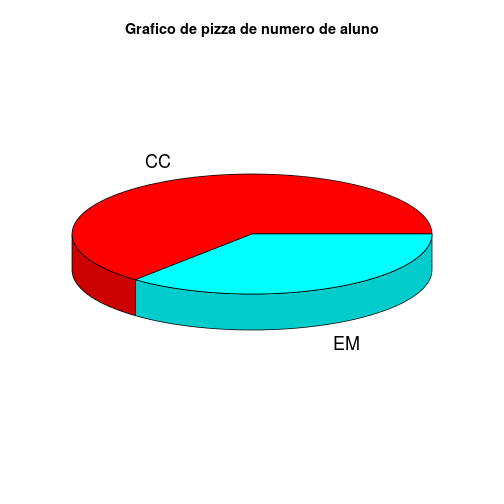
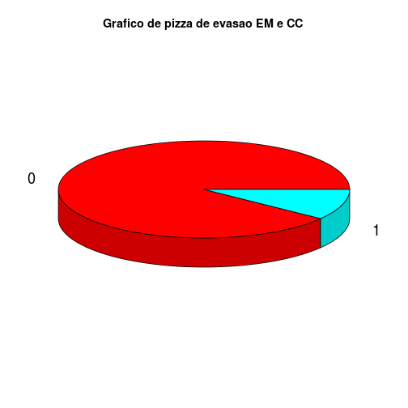
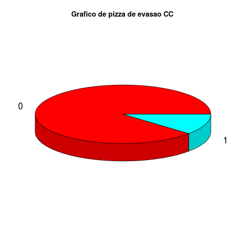
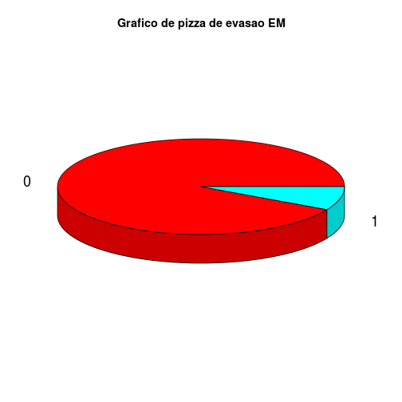

AD2 - Problema 05
========================================================
Os dados foram modificados de acordo com o seguinte modelo:
* matricula: Matricula do aluno
* curso: Codigo do curso
* totalcadeira: Numero de cadeiras colocadas
* reprovanota: Proporção de cadeiras que o aluno perdeu
* reprovafalta: Proporção de cadeiras que o aluno perdeu por faltas
* trancado: Proporção de cadeiras que o aluno trancou
* media: Media das notas
* codevasao: Codigo de evasão

--------------------------------------------------------
Summary dos dados de treinamento de CC e EM

```
##      matricula        curso      totalcadeira   reprovadonota   
##  292860458:  1   11124100:138   Min.   :1.000   Min.   :0.0000  
##  292860461:  1   14102100:243   1st Qu.:5.000   1st Qu.:0.0000  
##  292860470:  1                  Median :6.000   Median :0.0000  
##  292860473:  1                  Mean   :5.535   Mean   :0.1145  
##  292860476:  1                  3rd Qu.:6.000   3rd Qu.:0.1667  
##  292860479:  1                  Max.   :8.000   Max.   :0.8333  
##  (Other)  :375                                                  
##  reprovadofalta       trancado           perido        media      
##  Min.   :0.00000   Min.   :0.00000   2006.1 : 49   Min.   :0.000  
##  1st Qu.:0.00000   1st Qu.:0.00000   2006.2 : 43   1st Qu.:5.083  
##  Median :0.00000   Median :0.00000   2008.1 : 43   Median :6.975  
##  Mean   :0.09154   Mean   :0.03105   2009.1 : 40   Mean   :6.168  
##  3rd Qu.:0.00000   3rd Qu.:0.00000   2007.1 : 38   3rd Qu.:7.933  
##  Max.   :1.00000   Max.   :1.00000   2007.2 : 35   Max.   :9.800  
##                                      (Other):133                  
##  codevasao  curso_nome       
##  0:342     Length:381        
##  1: 39     Class :character  
##            Mode  :character  
##                              
##                              
##                              
## 
```
Summary dos dados de treinamento de CC

```
##      matricula        curso      totalcadeira   reprovadonota   
##  292860458:  1   14102100:243   Min.   :1.000   Min.   :0.0000  
##  292860461:  1                  1st Qu.:5.000   1st Qu.:0.0000  
##  292860470:  1                  Median :6.000   Median :0.0000  
##  292860473:  1                  Mean   :5.366   Mean   :0.1348  
##  292860476:  1                  3rd Qu.:6.000   3rd Qu.:0.2000  
##  292860479:  1                  Max.   :8.000   Max.   :0.8333  
##  (Other)  :237                                                  
##  reprovadofalta       trancado           perido       media      
##  Min.   :0.00000   Min.   :0.00000   2009.1 :30   Min.   :0.000  
##  1st Qu.:0.00000   1st Qu.:0.00000   2008.1 :29   1st Qu.:5.298  
##  Median :0.00000   Median :0.00000   2006.1 :28   Median :7.000  
##  Mean   :0.07717   Mean   :0.02332   2006.2 :24   Mean   :6.191  
##  3rd Qu.:0.00000   3rd Qu.:0.00000   2007.2 :23   3rd Qu.:7.900  
##  Max.   :1.00000   Max.   :1.00000   2008.2 :23   Max.   :9.775  
##                                      (Other):86                  
##  codevasao  curso_nome       
##  0:215     Length:243        
##  1: 28     Class :character  
##            Mode  :character  
##                              
##                              
##                              
## 
```
Summary dos dados de treinamento de EM

```
##      matricula        curso      totalcadeira   reprovadonota    
##  292861733:  1   11124100:138   Min.   :1.000   Min.   :0.00000  
##  292861739:  1                  1st Qu.:6.000   1st Qu.:0.00000  
##  292861748:  1                  Median :6.000   Median :0.00000  
##  292861754:  1                  Mean   :5.833   Mean   :0.07874  
##  292861757:  1                  3rd Qu.:7.000   3rd Qu.:0.14286  
##  292861763:  1                  Max.   :8.000   Max.   :0.75000  
##  (Other)  :132                                                   
##  reprovadofalta      trancado           perido       media       codevasao
##  Min.   :0.0000   Min.   :0.00000   2006.1 :21   Min.   :0.000   0:127    
##  1st Qu.:0.0000   1st Qu.:0.00000   2006.2 :19   1st Qu.:4.956   1: 11    
##  Median :0.0000   Median :0.00000   2007.1 :17   Median :6.807            
##  Mean   :0.1168   Mean   :0.04467   2008.1 :14   Mean   :6.127            
##  3rd Qu.:0.0000   3rd Qu.:0.00000   2010.2 :13   3rd Qu.:7.961            
##  Max.   :1.0000   Max.   :1.00000   2007.2 :12   Max.   :9.800            
##                                     (Other):42                            
##   curso_nome       
##  Length:138        
##  Class :character  
##  Mode  :character  
##                    
##                    
##                    
## 
```

Proporção entre o numero de alunos de EM e CC

```
## 
##        CC        EM 
## 0.6377953 0.3622047
```

 

Proporção entre o numero de alunos quem evadiram de EM e CC e ambos

```
## 
##         0         1 
## 0.8976378 0.1023622
```

 

```
## 
##         0         1 
## 0.8847737 0.1152263
```

 

```
## 
##          0          1 
## 0.92028986 0.07971014
```

 

