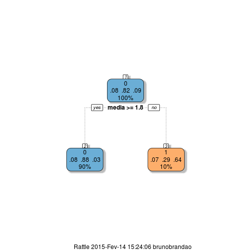

AD2 - Problema 05
========================================================
Modificando os dados de acordo com o seguinte modelo:
* matricula: Matricula do aluno
* curso: Codigo do curso
* totalcadeira: Numero de cadeiras colocadas
* reprovanota: Proporção de cadeiras que o aluno perdeu
* reprovafalta: Proporção de cadeiras que o aluno perdeu por faltas
* trancado: Proporção de cadeiras que o aluno trancou
* periodo: Periodo de ingresso do aluno
* media: Media das notas
* codevasao: Codigo de evasão


```
##    matricula     curso totalcadeira reprovadonota reprovadofalta  trancado
## 1 299160737  14102100          6.0      0.0000000      0.0000000 0.0000000
## 2 302160320  14102100          2.0      0.0000000      0.0000000 0.0000000
## 3 295861763  11124100          7.0      0.1428571      0.5714286 0.1428571
## 4 301860491  14102100          6.0      0.0000000      0.0000000 0.0000000
## 5 298860971  11124100          6.0      0.0000000      0.0000000 0.0000000
## 6 298860188  14102100          3.0      0.0000000      0.0000000 0.0000000
##    perido    media codevasao
## 1 2008.2  8.300000         0
## 2 2009.2  7.600000         0
## 3 2007.1  1.328571         0
## 4 2009.1  9.200000         0
## 5 2008.1  8.966667         0
## 6 2008.1  7.666667         0
```

Proporção entre o numero de alunos que evadiram e que não evadiram

```
## 
##         0         1 
## 0.8976378 0.1023622
```

Proporção do periodo ingresso

```
##          
##                    0          1
##   2006.1  0.95918367 0.04081633
##   2006.2  1.00000000 0.00000000
##   2007.1  0.92105263 0.07894737
##   2007.2  0.74285714 0.25714286
##   2008.1  1.00000000 0.00000000
##   2008.2  0.94285714 0.05714286
##   2009.1  0.87500000 0.12500000
##   2009.2  0.89285714 0.10714286
##   2010.1  0.79166667 0.20833333
##   2010.2  0.81818182 0.18181818
##   2011.1  0.75000000 0.25000000
```

Proporção entre o numero periodo ingresso e evasão

```
##          
##                    0          1
##   2006.1  0.95918367 0.04081633
##   2006.2  1.00000000 0.00000000
##   2007.1  0.92105263 0.07894737
##   2007.2  0.74285714 0.25714286
##   2008.1  1.00000000 0.00000000
##   2008.2  0.94285714 0.05714286
##   2009.1  0.87500000 0.12500000
##   2009.2  0.89285714 0.10714286
##   2010.1  0.79166667 0.20833333
##   2010.2  0.81818182 0.18181818
##   2011.1  0.75000000 0.25000000
```

Proporção do numero de cadeiras

```
## 
##        1.0         2.0         3.0         4.0         5.0         6.0  
## 0.020997375 0.034120735 0.036745407 0.083989501 0.112860892 0.551181102 
##        7.0         8.0  
## 0.152230971 0.007874016
```

Proporção entre o numero de cadeiras e evasão

```
##       
##                 0          1
##   1.0  0.75000000 0.25000000
##   2.0  0.84615385 0.15384615
##   3.0  0.78571429 0.21428571
##   4.0  0.84375000 0.15625000
##   5.0  0.83720930 0.16279070
##   6.0  0.92380952 0.07619048
##   7.0  0.93103448 0.06896552
##   8.0  1.00000000 0.00000000
```

Para melhor visualizar melhor criei um novo campo 'mediacat' que separa as notas em:
* 0.0 - 2.5
* 2.5 - 5.0
* 5.0 - 7.5
* 7.5 - 10


Proporção de media

```
## 
## 0.0 - 2.5 2.5 - 5.0 5.0 - 7.5 7.5 - 10. 
## 0.1128609 0.1312336 0.3963255 0.3595801
```
Proporção entre media e evasão

```
##            
##                      0          1
##   0.0 - 2.5 0.37209302 0.62790698
##   2.5 - 5.0 0.92000000 0.08000000
##   5.0 - 7.5 0.94701987 0.05298013
##   7.5 - 10. 1.00000000 0.00000000
```

Para melhor visualizar melhor criei um novo campo 'reprovcat' que separa os alunos entre:
* Reprovou nenhuma
* Reprovou até metade
* Reprovou mais da metade


Proporção de reprovações

```
## 
##     Ate metade Mais da metade        Nenhuma 
##     0.27034121     0.07874016     0.65091864
```
Proporção entre reprovações e evasão

```
##                 
##                          0         1
##   Ate metade     0.8640777 0.1359223
##   Mais da metade 0.8000000 0.2000000
##   Nenhuma        0.9233871 0.0766129
```

Para melhor visualizar melhor criei um novo campo 'reprovcatf' que separa os alunos entre:
* Reprovou nenhuma por falta
* Reprovou até metade por falta
* Reprovou mais da metade por falta


Proporção de reprovações por falta

```
## 
##     Ate metade Mais da metade        Nenhuma 
##     0.08923885     0.08923885     0.82152231
```
Proporção entre reprovações por falta e evasão

```
##                 
##                          0         1
##   Ate metade     0.8529412 0.1470588
##   Mais da metade 0.5000000 0.5000000
##   Nenhuma        0.9456869 0.0543131
```

Criação de um novo campo 'tranccat' que separa os alunos entre:
* Trancou nenhuma
* Trancou até metade
* Trancou mais da metade


Proporção de trancamento

```
## 
##     Ate metade Mais da metade        Nenhuma 
##     0.03674541     0.02362205     0.93963255
```
Proporção entre trancamento e evasão

```
##                 
##                           0          1
##   Ate metade     0.92857143 0.07142857
##   Mais da metade 0.22222222 0.77777778
##   Nenhuma        0.91340782 0.08659218
```

Dessa forma resolvi colocar na árvore os atributos: Media, Reprovações por nota, Reprovações por nota e Trancamentos.

 


